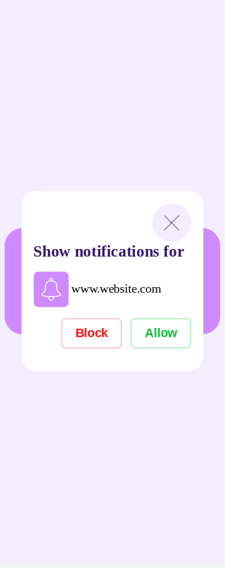
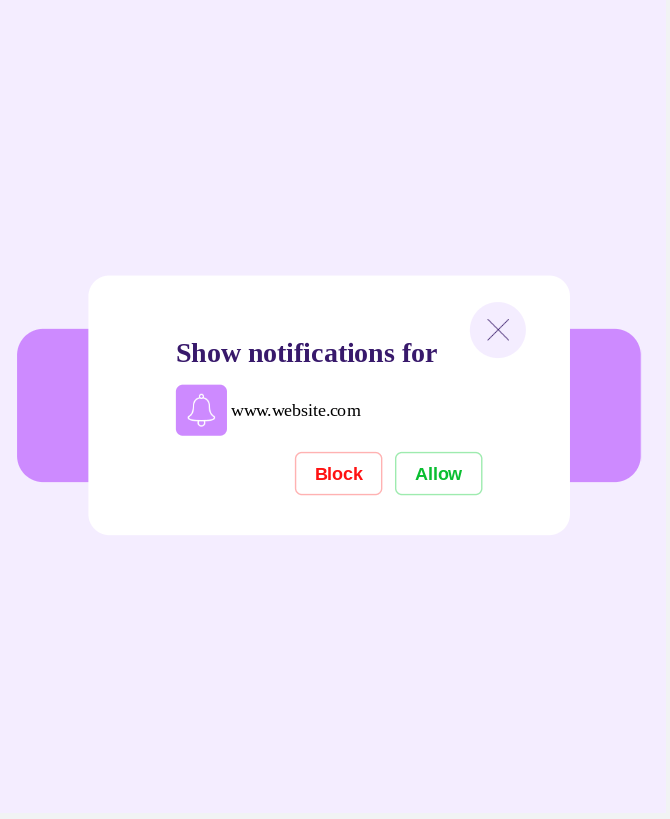
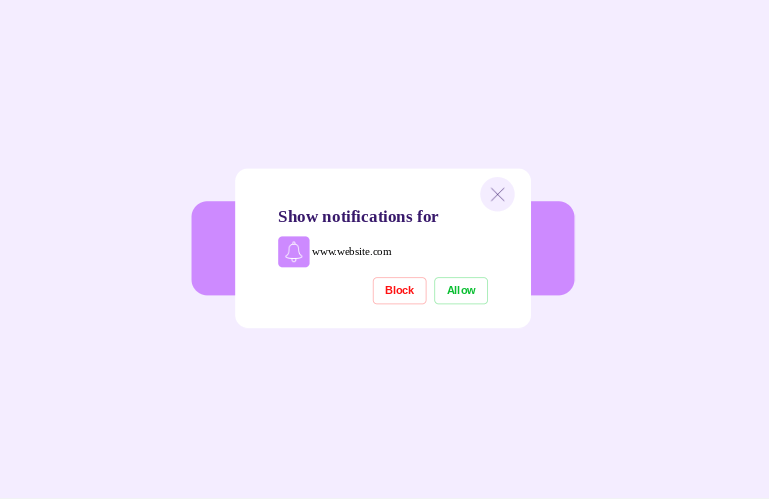

<h1 align="center">UI Design Daily - #1559 Notification</h1>

## Table of contents

- [Overview](#overview)
- [Screenshots](#screenshots)
- [Links](#links)
- [Continued Development](#continued-development)
- [Useful Resources](#useful-resources)

## Overview

[UI Design Daily design](https://www.uidesigndaily.com/posts/figma-notification-day-1559) translated to real code.  

## Screenshots

## Links

- [Live Link](https://jdegand.github.io/ui-notification)

## Continued Development

- Accessibility
- Icons are not perfect match.

## Useful Resources

- [Icons8](https://icons8.com)